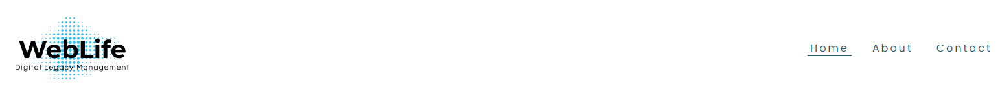
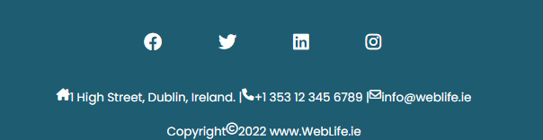

# **[WebLife Digital Legacy Management](https://grumpyrobot21.github.io/WebLife---Portfolio-Project-1---HTML-CSS-Essentials/)**

## **Milestone Portfolio Project 1 - HTML /CSS Essentials - Code Institute Full Stack Developer Diploma.**

  

## **INTRODUCTION.**

This web application has been developed in order to stimulate discussion around the topic of what happens to our online data after we are no longer around to look after it. The website represents a fictional consultancy that offers to manage clients digital legacies prior to and in the event of their deaths. To view the full website please use the clickable link via the heading at the top of this page or alternatively, click on the following link to access the site: [WebLife Digital Legacy Management](https://grumpyrobot21.github.io/WebLife---Portfolio-Project-1---HTML-CSS-Essentials/)

## **DESIGN GOALS.**

The aim was to create a streamlined site with two specific goals in mind. The first goal is purely a cognitive one, encourage users to consider this important topic in todays increasingly online environment. The second goal is entirely a functional and business related one. Namely, use the site design to funnel users towards booking a consultation by enticing and guiding them towards the contact page using visual stimulation and robust, clear and uncluttered site navigation.

***

## **DESIGN FEATURES.**
* ### **Navigation Bar.**

  

This has been designed to be clear and efficient. The logo sits to the left and the three nav buttons sit to the right. The active page is underlined to remind the user which page they are currently on. When the cursor is hovered over any nav button the animation highlights it to show that it is being engaged by the user. The animation disengages once the cursor has been moved away. After a page has initially loaded, the skip navigation function can be engaged by pressing the TAB button where it will drop down from the top left of the page in order to assist users navigating the site using their keyboards as the primary input device. The navigation bar functionality and design are the same for each page in order to maintain optimal user engagement.

* ### **Footer.**

  

The footer has been designed to be informative and simple in it's presentation. It should not detract from the main page content yet provide relevant and helpful information for the user to engage with when required. The business contact location, email address and telephone number are clearly displayed below links to social media icons. The icons are animated when the cursor is hovered above to clearly indicate which icon is being engaged by the user. Each link opens the relevant page in a separate tab. The footer functionality and design are the same for each page in order to maintain optimal user engagement.

* ### **Page Design.**
All four pages follow the same color scheme and design concept. The feel of the site has been specifically created to portray a clean, competent and efficient experience that conveys knowledge and professionalism to the user. All page images are related to either the online environment described in the page content or relate to the description of services. 

 1. #### **Home Page.**
 Below the navbar are the hero Image and an overlayed attention grabbing quote. These have been designed to immediately capture the users interest and draw them into the following paragraph. The core business services are described underneath the introductory paragraph followed by a large bold action button to take them further into the site for more detailed information.

 2. #### **About Page.**
Here the user is further educated on the issues facing the majority of the world regarding their online legacy. While describing the issues at hand the user is also stimulated to do something about it and encouraged to discuss the possibilities further with WebLife. The action button at the bottom of the page is large and bold to encourage the user to move onto the next stage and schedule a free consultation.

 3. #### **Contact Page.**

This is deliberately simple and clean in it's design. The user has only to fill in the details and submit the form to schedule their consultation. With the completion of this action the purpose of the web app has been fulfilled. 

3. #### **Thank you Page.**
This is a simple thank you page to confirm that the users contact page form submission has been completed and to reassure them that their consultant will be in touch within a predetermined time limit. There is an action button to return to the home page so the user has the option to re-read the site information.

***

* ### **Colour Palette.**
The colour palette is purposefully simple and clean. It consists almost entirely of the two following colours: #1e5c71 and White.

  

 

  
 

These two colors provide a high level of contrast for users with impaired vison, as confirmed in the testing section below. They also add to the overall goal of creating a clear professional and efficient looking website. The colors were chosen in conjunction with the main logo design to present a smooth connection across the application. This helps provide consistency to the overall aesthetic flow of the user experience.

* ### **Font.**
The chosen font is a geometric sans serif typeface named Poppins. This is a modern and clean font that is easy and clear to interpret as well as adding to the modern design ethos of the site. This is the official font description courtesy of the google fonts page "Geometric sans serif typefaces have been a popular design tool ever since these actors took to the world’s stage. Poppins is one of the new comers to this long tradition. With support for the Devanagari and Latin writing systems, it is an internationalist take on the genre."

***

## **USER JOURNEY.**

For the purposes of this journey our 'First time' user will be called 'Bob'. Bob is a young professional who has a great number of online profiles and accounts across many platforms. Like most of Bob's generation, Bob does a lot of things online for recreational, personal and business purposes.

-  Bob has looked up the site because he wants to learn more about the importance of managing his online digital legacy and he is aware that he has a growing portfolio of online data and assets to keep under control. He lands on the home page and is immediately struck by the hero banner quote. This piques his interest and he continues to read down the page where he learns a little about the company and what it does for potential clients. On reaching the bottom pf the page Bob sees the prominent button to learn more. The social media icons are also clear and on display so Bob can easily subscribe to his preferred platforms and follow the WebLife media pages to be kept up to date on the latest news and developments. Bob clicks on the button to learn more. PAGE AIM: To capture the users interest while presenting the user with clear and concise navigation choices and clearly defined social media links. 

- Bob is now on the ABOUT US page. This page elaborates on the initial information encountered previously. Here Bob is now more aware of the issues faced by modern internet users and how there is a need to be more in control of their online assets. Bob is now intrigued, curious and genuinely interested in a no strings attached free consultation with an expert. Bob clicks on the prominent action button at the foot of the page to move deeper into the application. PAGE AIM: To provide more detailed information and drive a users curiosity with the perception of an issue that needs to be dealt with. The ultimate goal is to drive traffic to the CONTACT US page and get the user to engage positively by submitting the completed form.

- Bob has now been taken to the CONTACT US submission form. He is unable to submit it until he has fully completed all of the fields. This is clearly indicated in a concise and helpful manner. Bob easily fills out the prerequisite information and submits the form. He is immediately informed that his message has been received and that an expert will be in touch within 24 hours. This pleases Bob and as Bob is interested in keeping up with relevant news he signs up to his preferred choice of social media accounts via the icons at the bottom of the page. PAGE AIM: To compel the user to complete the form and engage with the company directly. With the user filling in the form and submitting it the web application will have succeeded in it's primary purpose.

* ### **Returning Users.** 
This site in its current form is designed specifically to generate new customer leads and drive traffic to the contact page where they engage directly with the company. As a result it is not yet fully developed for returning users. This functionality will be addressed in the 'Future Aspirations' section below.

***
## **WIREFRAMES.**
For the three main pages the wireframe preliminary layout design can be seen below. This was done using [Balsamiq](https://balsamiq.com/):

- ### **Home** 

- ### **About** 

- ### **Contact** 

***
## **TESTING.**
- ### **HTML Testing**
The following test results were achieved for the individual pages (index.html, about.html, contact.html & thankyou.html) using the [W3C Markup Validation Service](https://validator.w3.org/) 
- index.html

- about.html

- contact.html

- thankyou.html

- ### **CSS Testing**

## **DEPLOYMENT.**
## **FUTURE ASPIRATIONS.**
## **TOOLS USED AND CODING INSPIRATION.**