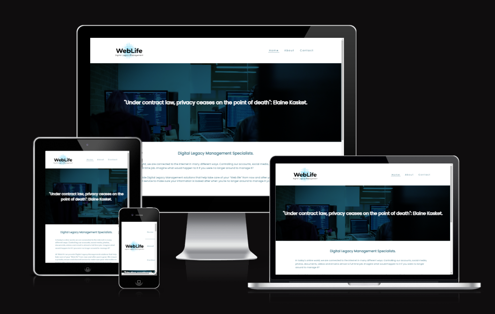

# **[WebLife Digital Legacy Management](https://grumpyrobot21.github.io/WebLife---Portfolio-Project-1---HTML-CSS-Essentials/)**

## **Milestone Portfolio Project 1 - HTML /CSS Essentials - Code Institute Full Stack Developer Diploma.**

  

  ## **INTRODUCTION.**

This web application has been developed in order to stimulate discussion around the topic of what happens to our online data after we are no longer around to look after it. The website represents a fictional consultancy that offers to manage clients digital legacies prior to and in the event of their deaths.

The aim was to create a streamlined site with two specific goals in mind. The first goal is purely a cognitive one, encourage users to consider this important topic in todays increasingly online environment. The second goal is entirely a functional and business related one. Namely, use the site design to funnel users towards booking a consultation by enticing and guiding them towards the contact page using visual stimulation and robust, clear and uncluttered site navigation.